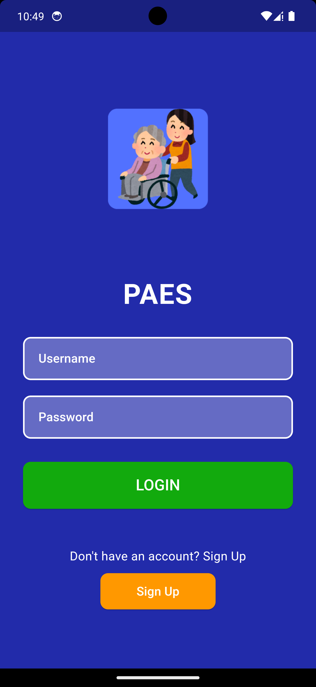

Caregiver Application
Introduction

The Caregiver Application is a mobile app designed to streamline the process of tracking patient needs, assigning physical therapy programs, and monitoring patient progress. This comprehensive tool ensures efficient and timely patient care management.
Features

    Track Patient Needs: Receive notifications about patient needs.
    Assign Exercises: Assign and monitor physical therapy programs.
    Patient Management: Securely manage patient information.
    Seamless Communication: Real-time synchronization with the desktop application.

Technologies Used

    Framework: Flutter
    Database: MongoDB

Setup Instructions
Prerequisites

    Flutter SDK
    MongoDB instance

Installation

    Clone the repository:

    sh

git clone https://github.com/CSE396-Group10-2024/caregiver-app.git
cd caregiver-app

Install dependencies:

sh

flutter pub get

Run the application:

sh

    flutter run

Usage Instructions
Authentication

Log in to the app using your credentials. If you don’t have an account, sign up using the registration feature.
Dashboard

Upon logging in, you will see a dashboard displaying notifications and patient information.

Screenshots:
Patient Management

Navigate to the patient list to view and manage patients. Add new patients or update existing patient information.

Screenshots:
Assigning Exercises

Select a patient to assign exercises. Choose from predefined exercise routines or create custom ones.

## Usage Instructions

### Authentication
Log in to the app using your credentials. If you don’t have an account, sign up using the registration feature.

## Usage Instructions

### Authentication
Log in to the app using your credentials. If you don’t have an account, sign up using the registration feature.

**Login Screen:**

**Sign Up Screen:**

### Dashboard
Upon logging in, you will see a dashboard displaying notifications and patient information.

**Dashboard Screenshot:**

### Patient Management
Navigate to the patient list to view and manage patients. Add new patients or update existing patient information.

**Patient Management Screenshot:**

### Assigning Exercises
Select a patient to assign exercises. Choose from predefined exercise routines or create custom ones.

**Assign Exercises Screenshot:**

### Video Stream
Monitor patient progress through a live video stream.

**Video Stream Screenshot:**

**Therapy In Progress Screenshot:**

